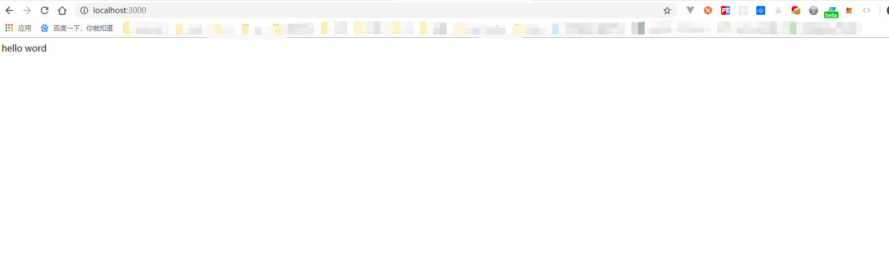

# simple mall

这是simple mall的git 仓库，里面是平时写的逻辑代码；

### clone 仓库

```shell

git clone https://github.com/Jhaidi/SimpleMall.git

npm install

npm run dev
```

终端执行成功 打开浏览器 输入http://localhost:3000



### 目录解析

|- config
|  |- express.js //express配置文件
|  |- mongoose.js //mongodb链接mongodb配置文件
|- static // 静态文件夹 用于放置一些图片之类的静态文件
|- index.js //项目主入口
|- package.json //项目配置文件
|- README.md //readme文件

### 计划

- [x] 配置开发环境
- [x] 编写开发环境
- [ ] 定义数据结构
- [ ] 编写用户模块相关代码
- [ ] 编写商品模块相关代码